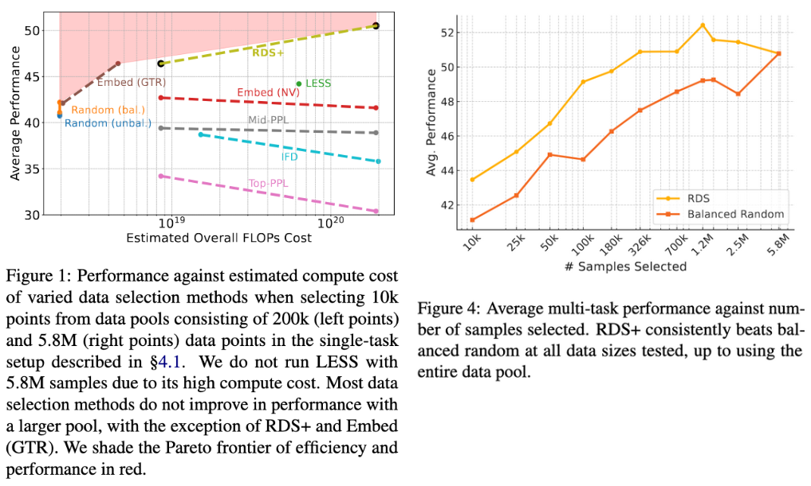

# Automated Instruction Selection

This is the repository associated with the paper [Practical Large-Scale Data Selection for Instruction Tuning](https://todo).


*Left: Average performance of models trained using increasingly more samples selected using RDS or balanced random selection from a pool of 5.8M data points. RDS performs better across all sizes. Right: Average performance of model trained on data selected using RDS compared to other data selection methods when selecting from a pool of 200k samples. RDS performs best overall.*

We release data and models associated with this paper on HuggingFace at [this collection](https://huggingface.co/collections/hamishivi/practical-large-scale-data-selection-for-instruction-tuning-677d7e8ca0295426c1915930).

## Install Dependencies

Note I assume you are working in a Linux environment with CUDA-compatible GPUs and conda.

Install the requirements in `environment.yml` and `requirements.txt`:
```bash
conda env create --file environment.yml --name mmft
conda activate mmft
pip install -r requirements.txt
```

Download the required data files (for eval and training):
```bash
./shell_scripts/download_eval_data.sh
./shell_scripts/download_train_data.sh  # optional if you don't want to do data selection on Tulu datasets.
```

Now you should be good to go!
If you are at Ai2, then you don't even need these steps, since we have a bunch of [beaker-gantry](https://github.com/allenai/beaker-gantry) scripts that should automatically setup the environment when you run them.

## Run the Selection and Training Pipeline

The pipeline for this paper has four steps, described below:
1. Construct an index for training and eval data.
2. Select data based off the score.
3. Train a model on the selected data.
4. Evaluate the trained model.

### Index creation and selection

Scripts for doing indexing and selection live in `shell_scripts/core_commands/index_selection_and_creation`. I have support for a few different approaches here, but the most important one is RDS (see our paper for more details on this).

We start by indexing our training data, using a given base model:
```bash
python -m minimal_multitask.compute_influence_cosinesim \
    --model_name meta-llama/Llama-2-7b-hf \
    --seed 42 \
    --train_dataset data/training_data/tulu_v2_unfiltered_data_dedup.jsonl \
    --eval_dataset alpacafarm \
    --index_path rds_200k_exp_from_base_weighted_mean_pool/cosine_train_reps.pt \
    --save_dir rds_200k_exp_from_base_weighted_mean_pool/ \
    --batch_size 1 \
    --pooling weighted_mean
```
This gives us an index we can re-use for future queries. We then query for the eval set we care about, loading this train index:
```bash
for dataset in alpacafarm gsm8k_shots bbh_shots tydiqa_shots codex squad mmlu_shots; do
    python -m minimal_multitask.compute_influence_cosinesim \
        --model_name meta-llama/Llama-2-7b-hf \
        --seed 42 \
        --train_dataset data/training_data/tulu_v2_unfiltered_data_dedup.jsonl \
        --eval_dataset $dataset \
        --index_path rds_200k_exp_from_base_weighted_mean_pool/cosine_train_reps.pt \
        --save_dir rds_200k_exp_from_base_weighted_mean_pool_${dataset}/ \
        --batch_size 1 \
        --pooling weighted_mean
done
```
Finally, we want to use the computed scores to produce selected datasets for us:
```bash
for dataset in alpacafarm gsm8k_shots bbh_shots tydiqa_shots codex squad mmlu_shots; do
    python -m minimal_multitask.get_top_influences \
        --input_files rds_200k_exp_from_base_weighted_mean_pool/${dataset}_cossim.pkl \
        --output_file rds_200k_exp_from_base_weighted_mean_pool/${dataset}_top10k.json \
        --output_size 10000 --selection_method max \
        --train_datasets training_data/tulu_v2_unfiltered_data_dedup.jsonl \
        --output_dataset
done
```
We can then directly finetune on the resulting dataset with e.g.:
```bash
./shell_scripts/core_commands/model_training/full_finetune.sh rds_200k_exp_from_base_weighted_mean_pool/alpacafarm_top10k.json alpacafarm_exp
```

#### Sharded Indexing

Some of the datasets we indexed are quite large, and so to process these efficiently we relied on sharding them. We provide easy ways to do this in this codebase.

First, shard your dataset (e.g. using the `split` command): `split -l 200000 <filename>`.
Pick your shard size based on how many gpus you can run in parallel.

Then, for each shard, run the training data and eval data indexing:
```bash
for file in shards/*.jsonl; do
    shard=$(basename $file .jsonl)
    echo "Processing $shard"
    python -m minimal_multitask.compute_influence_cosinesim \
        --model_name meta-llama/Llama-2-7b-hf \
        --seed 42 \
        --train_dataset $file \
        --eval_dataset alpacafarm \
        --index_path rds_selection_${shard}/cosine_train_reps.pt \
        --save_dir rds_selection_${shard}/ \
        --batch_size 1 \
        --pooling weighted_mean
done

for dataset in alpacafarm gsm8k_shots bbh_shots tydiqa_shots codex squad mmlu_shots; do
    for file in shards/*.jsonl; do
        shard=$(basename $file .jsonl)
        echo "Processing $shard"
        python -m minimal_multitask.compute_influence_cosinesim \
            --model_name meta-llama/Llama-2-7b-hf \
            --seed 42 \
            --train_dataset $file \
            --eval_dataset $dataset \
            --index_path rds_selection_${shard}/cosine_train_reps.pt \
            --save_dir rds_selection/${dataset}/${shard}/ \
            --batch_size 1 \
            --pooling weighted_mean
    done
done
```

We then combine the sharded scores into one file. Note this takes a lot of RAM:
```bash
for dataset in alpacafarm bbh_shots codex gsm8k_shots tydiqa_shots mmlu_shots squad arena_hard wildchat; do
    python scripts/combine_pickles.py --input_files rds_selection/${dataset}/**/*.pkl --output_file rds_selection/${dataset}_cossim.pkl
done
```

Finally, given this we can then select datasets. I also have some more optimized selection code that helps when selecting large datasets.
Note you need the full datafile around to construct the train file.
```bash
for dataset in alpacafarm bbh_shots codex gsm8k_shots tydiqa_shots mmlu_shots squad arena_hard wildchat; do
    python -m minimal_multitask.get_top_optimized \
        --input_files rds_selection/${dataset}_cossim.json \
        --output_file rds_selection/${dataset}_top10k.json \
        --output_size 10000 --selection_method max \
        --train_datasets <original full datafile>
done

# or if you want to use the round-robin setup
python -m minimal_multitask.get_top_aggregated_influences \
    --input_files rds_selection/*_cossim.json \
    --output_file rds_selection/multitask_rrmax_320k.json \
    --output_size 320000 --selection_method max \
    --train_dataset <original full datafile> \
    --output_dataset
```

### Training

To train a model, you can use the scripts in `shell_scripts/core_commands/model_training`. The scripts named do the appropriate things. You have to provide a `.jsonl` file, which contains data formatted following the tulu format (i.e. like [the huggingface tulu 2 dataset](https://huggingface.co/datasets/allenai/tulu-v2-sft-mixture)). You can also randomly subselect from this dataset, or train loras on top of a trained model, or train loras and full finetune. The scripts are mostly self-descriptive.

For example, to train llama 2 7b on a given file, I can run:
```bash
./shell_scripts/core_commands/model_training/full_finetune.sh <filename> <run name>
```
Or to train on x random samples from a file:
```bash
./shell_scripts/core_commands/model_training/random_select.sh <filename> <run name> <x>
```
Please look into the scripts and feel fre to edit them (in particular, you might wish to edit the output directory name).

You can also run locally with:
```bash
python -m minimal_multitask.instruction_tune \
        --model_name /model \
        --output_dir /results \
        --per_device_train_batch_size 1 \
        --gradient_accumulation_steps 128 \
        --num_train_epochs 2 \
        --learning_rate 2e-5 \
        --seed 42 \
        --warmup_ratio 0.03 \
        --lr_scheduler_type linear \
        --weight_decay 0. \
        --evaluation_strategy no \
        --save_strategy no \
        --logging_steps 1 \
        --is_llama=True \
        --lora_alpha 512 \
        --lora_rank 128 \
        --use_hf_auth_token True \
        --train $TRAIN_FILE
```

Just replace the flags with what makes sense for you. If you remove the `lora_{alpha/rank}` flags then full-finetuning will happen.

If you are at Ai2, you can use gantry with these scripts by setting `GANTRY=1` before running the script, e.g:
```bash
GANTRY=1 ./shell_scripts/core_commands/model_training/full_finetune.sh <filename> <run name>
```


### Evaluation

Given a trained model, you can evaluate using `eval/eval.sh <model_path>`. Look into that script if you want to run a particular eval.
We base our evaluations off the implementations in [Open-Instruct](https://github.com/allenai/open-instruct).
**Note: for non-llama 2 models, please replace `create_prompt_with_tulu_chat_format` with `create_prompt_with_huggingface_tokenizer_template` -- this is to make sure chat templates are correctly set.

To evaluate internally at Ai2, just run `./shell_scripts/eval/eval_beaker.sh <model_name> <beaker dataset id>`.

### Analysis

Generally, analysis and utility scripts live in `scripts`. These are undocumented for now, but feel free to poke around in there. I also have a tonne of old scripts from a previous version of this project in `scripts/old`.
